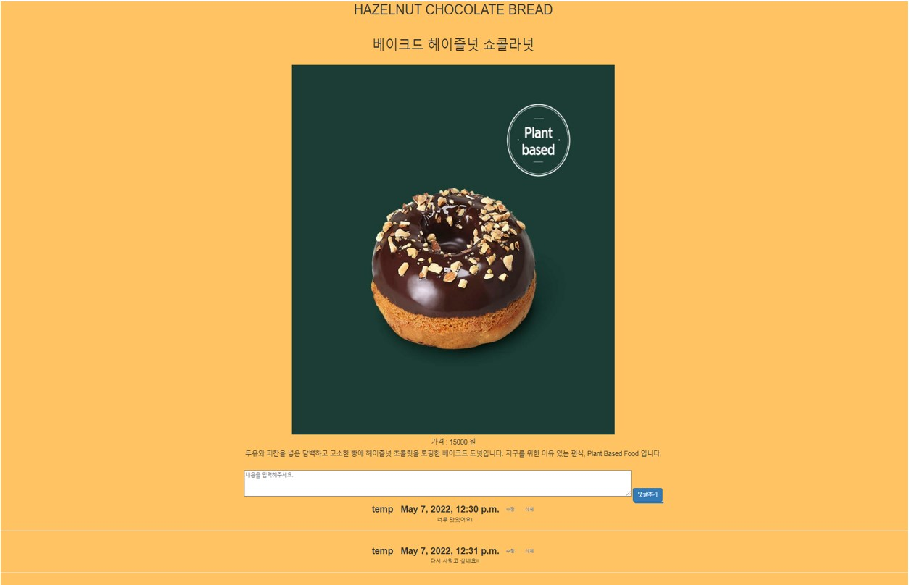

# JobBootCamp

[고양시청일자리센터] 

기획부터 개발까지 한 번에 경험하는 나에게 맞는 직무 체험 2022. 04. 11 ~ 2022. 05. 09 | 온라인

## 1주차

- 웹 개발 주제 기획
 

## 2주차

- 회사 상품 페이지 개발
 

## 3주차

- 회원기능 개발(db연동)
- 상품 상세페이지 개발(db연동)
- footer, header, navbar.html 나누기 
 

## 4주차

- 상품 상페이지에 댓글, 댓글 수정, 삭제 기능 구현(db연동)
- 관리자 페이지 개선

 

## 결과물

|Version|Date|Description|Author|
|---|---|------|---|
|V0.1|2022/04/14|부트스트랩 template - Business Casual을 이용해서 만들계획.|이현수|
|V0.2|2022/04/21|홈페이지에 대한 화면 설명 구체적으로 명세 및 개발.|이현수|
|V0.3|2022/04/29|Header, footer 템플릿화, product 미리보기, 상세 페이지 만들기 및 연결, 회원가입, 로그인 기능 만들기|이현수|
|V0.4|2022/05/07|상품상세페이지에 댓글 추가,수정,삭제 기능, 관리자 페이지 개선.|이현수|

 - 부트스트랩 무료 탬플릿 사용
 - 스타벅스 홈페이지에서 제품, 사진 참조
 

### 홈화면

### ABOUT

### 제품 페이지

### 제품 상세 페이지 + 댓글 추가, 수정, 삭제

### 로그인 

### 회원가입

